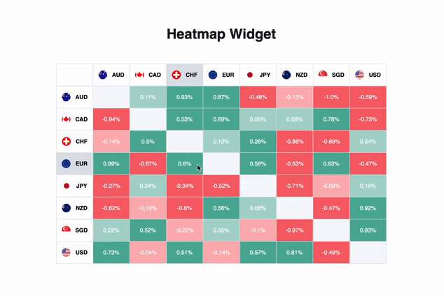

# digital-heatmap-widget


 Interactive hitmap that shows currency ratios. The table lets you compare cross rates and exchange rates of the most popular currencies throughout the world.

 Show off a snapshot of currency market action. This widget lets you spot strong and weak currencies and see how they compare to each other, all in real-time.

# Run server 

To start a server that generates random values for the currency ratio, run the following line:

```
    python ./server/server.py
```

# Run web-server 

To start a server that shows heatmap:

```
    node ./client.js
```